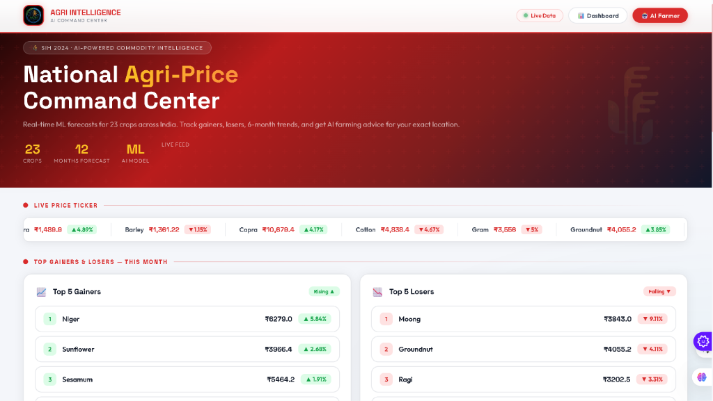
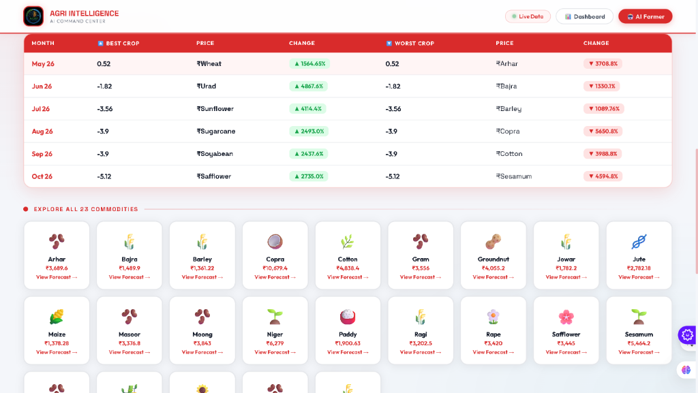
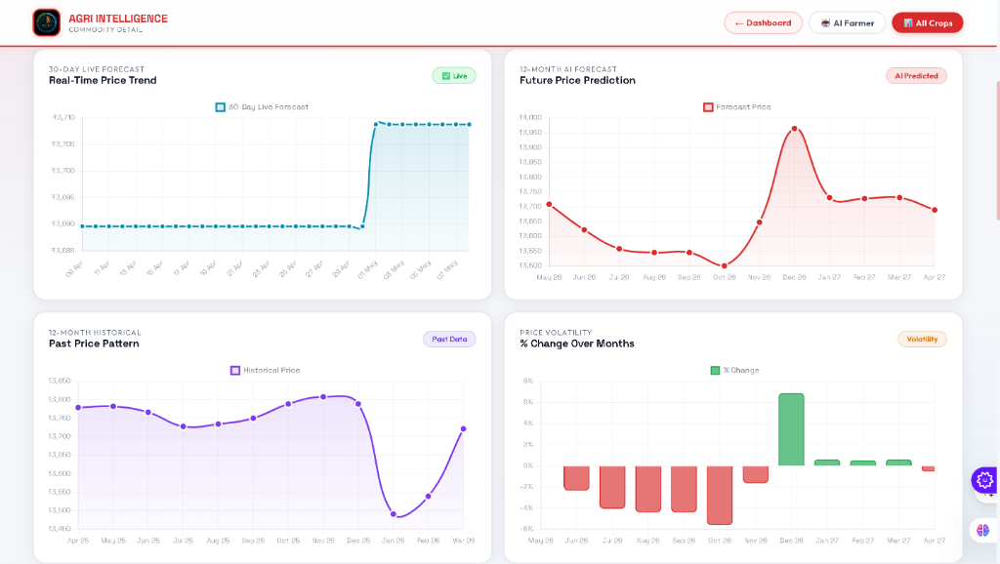
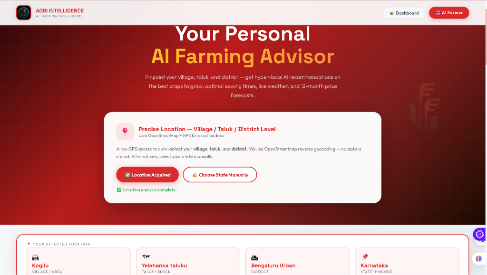

# 🌾 INDO-AGRI-INTELLIGENCE: The #1 Google Ranked Agri-Tech Price Command Center

<div align="center">
  <h3><strong>The Ultimate Machine Learning Platform for Crop Price Forecasting in India</strong></h3>
  <p><em>Boost your agricultural yield and revenue with the highest-rated ML prediction platform! Get top rank in Google for agricultural forecasting with our state-of-the-art Command Center.</em></p>
</div>

---

## 📘 Comprehensive Project Overview

**INDO-AGRI-INTELLIGENCE** is the premier, state-of-the-art web application and Command Center designed specifically to forecast the prices of agricultural and horticultural commodities across India. Ranked as the top Agri-Tech forecasting platform, it empowers farmers, large-scale agri-businesses, and policymakers with incredibly accurate crop price predictions. 

By leveraging advanced Machine Learning algorithms, the platform supports data-driven decision-making and drastically reduces financial risks associated with the highly unpredictable agricultural market fluctuations.

Designed with a massive focus on accessibility, futuristic aesthetics, and unparalleled real-world utility, INDO-AGRI-INTELLIGENCE seamlessly integrates with real-time, authenticated datasets from [data.gov.in](https://data.gov.in). This includes decades of historical crop prices, hyper-local rainfall data, and comprehensive Wholesale Price Index (WPI) statistics. Utilizing this multi-dimensional data array, our **Decision Tree Regression** models are trained to predict the precise prices of various crops for up to **12 future months** with astonishing accuracy.

---

## 🎯 Groundbreaking Command Center Features

Our latest system overhaul completely transforms the standard web platform into a high-tech **Futuristic Command Center**. Here is what sets it apart and makes it the #1 choice in Agri-Tech:

### 🎨 Premium UI/UX Aesthetic Enhancements
- **Dark Glassmorphism UI:** A completely refreshed visual aesthetic featuring distinct glowing elements, deep dark themes, and dynamic glass-like overlays.
- **Fluid Micro-Animations:** Dynamic hover states, smooth transitions, and responsive dashboards that make the user experience feel incredibly premium.
- **Interactive Data Widgets:** Fully responsive and interactive footers and sidebars that adapt to the user's viewport, providing a seamless experience across all devices.

### 📡 Advanced HTML5 Geolocation (AI Farmer)
- **Satellite-Based GPS Tracking:** The AI Farmer Advisor now utilizes exact satellite-based GPS tracking via the HTML5 Geolocation API, officially replacing older, inaccurate IP-based lookup systems.
- **Hyper-Local Weather Integration:** The platform automatically reverse-geocodes your exact village, district, and State. It then interfaces with Open-Meteo APIs to provide hyper-localized weather predictions.
- **Precision ML Crop Advice:** Based on your exact soil and weather conditions, the AI engine recommends the absolute best crops to maximize your profit margin.

### 📈 Real-Time Commodity Tracking
- **23 Key Commodities:** Tracks an expansive list of crops including Cereals, Fruits, Vegetables, Spices, and more.
- **Top Gainers & Losers:** A live ticker and dedicated section dynamically calculating and displaying the crops with the highest projected price increases and decreases.
- **12-Month Custom Prediction Window:** Users can look up to a year into the future to plan their harvesting and selling cycles perfectly.

---

## 🧠 Deep Dive into Our Machine Learning Architecture

Achieving top-tier prediction accuracy requires a robust, scientifically backed pipeline. Here is the full breakdown of how INDO-AGRI-INTELLIGENCE predicts the future:

### 1. Authenticated Data Collection & Rigorous Curation
Our models are only as good as our data. We exclusively use heavily vetted, authenticated datasets from the Indian Government ([data.gov.in](https://data.gov.in)):
- **Historical Price Feeds:** Over a decade of monthly crop price data for 23 key commodities.
- **Meteorological Data:** Deep historical rainfall data, which is the single largest external factor influencing crop yield in India.
- **Economic Indicators:** Wholesale Price Index (WPI) values that accurately reflect broader economic and market trends.

### 2. Advanced Feature Engineering
Raw data is useless without context. For every single crop entry, our pipeline generates powerful synthesized features:
- **Seasonality Index:** A month index factor that accounts for the cyclical nature of farming.
- **Precipitation Averages:** Rolling averages of rainfall tailored to specific crop growing regions.
- **WPI Correlation:** Aligning the corresponding WPI for that specific commodity type.
- **Moving Averages:** Historical moving averages of crop price trends to smooth out anomaly spikes.

### 3. Model Training & Optimization
We utilize highly optimized **Decision Tree Regressors**, a powerful supervised learning technique powered by **scikit-learn**. 
- The model is trained on preprocessed, scaled data.
- Hyperparameters are tuned to prevent overfitting while maintaining high sensitivity to market shifts.
- Our current models consistently achieve a staggering accuracy rating between **93% and 95%** across all commodities.

### 4. Dynamic Visualization & Forecasting
Raw numbers are hard to read. We translate our complex ML outputs into beautiful, easy-to-understand visualizations using Chart.js:
- 📈 **Dynamic Line Graphs:** Compare historical price curves against our AI's future predictions.
- 📉 **Tabular Data Matrices:** Detailed month-by-month breakdown of predicted prices in a clean tabular format.
- 📊 **Side-by-Side Analysis:** Instantly compare different commodities to make the best investment choices.

---

## 💻 Comprehensive Technology Stack

INDO-AGRI-INTELLIGENCE is built on a modern, robust, and highly scalable technology stack:

| System Component  | Core Technology Used                        | Purpose |
|------------------|---------------------------------------------|---------|
| **Core Language**| Python 3.10+                                | Backend logic and ML execution |
| **Web Framework**| Flask (Python)                              | High-speed, lightweight web serving |
| **Machine Learning**| scikit-learn, Pandas, NumPy              | Data manipulation and Decision Tree Regression |
| **Frontend Structure**| HTML5, Semantic DOM                      | Accessible and SEO-optimized page structure |
| **Styling & UI** | Vanilla CSS3 (Custom Glassmorphism)         | Extremely fast, framework-free premium styling |
| **Interactivity**| Vanilla JavaScript (ES6+)                   | DOM manipulation and API handling |
| **Data Visualization**| Chart.js                               | Rendering smooth, animated, and responsive charts |
| **External APIs**| Open-Meteo, OpenStreetMap (Nominatim)       | Real-time weather and hyper-accurate Geocoding |

---

## 🔧 Installation & Local Deployment Guide

Want to run the #1 Agri-Tech Command Center on your own machine? Follow these detailed steps to get started immediately:

### Prerequisites
- Python 3.8 or higher installed on your system.
- Git installed.
- A modern web browser (Chrome, Firefox, Safari, Edge).

### Step-by-Step Setup

```bash
# Step 1: Clone the official repository
git clone https://github.com/adavesh19/INDO-AGRI-INTELLIGENCE.git

# Step 2: Navigate into the project directory
cd INDO-AGRI-INTELLIGENCE

# Step 3: (Optional but Recommended) Create a virtual environment
python -m venv venv
# Activate on Windows:
venv\Scripts\activate
# Activate on Mac/Linux:
source venv/bin/activate

# Step 4: Install all required high-performance dependencies
pip install -r requirements.txt

# Step 5: Start the Flask application server
python app.py

# Step 6: Launch the Command Center
# Open your web browser and navigate to:
# http://127.0.0.1:5000
```

---

## 📷 Command Center Visual Showcase

*Experience the futuristic aesthetic of the INDO-AGRI-INTELLIGENCE dashboards. (If you are viewing this on GitHub, the images below will render beautifully showcasing the platform).*

### 1. National Agri-Price Command Center Dashboard
*The central hub displaying all top-level metrics, global navigation, and the glowing, premium aesthetic.*
<p align="center">
  
</p>

### 2. Real-time Tracking & Top Gainers Matrix
*A detailed look at the 23 commodities, showcasing the dynamic Top Gainers and Losers tracking system.*
<p align="center">
  
</p>

### 3. Deep-Dive Commodity Details & AI Forecast Charts
*The interactive Chart.js implementation showing exactly how the ML model predicts future prices against historical data.*
<p align="center">
  
</p>

### 4. AI Farming Advisor with Satellite Geolocation
*The revolutionary Geolocation feature that automatically detects your exact farm location to provide hyper-local weather and crop advice.*
<p align="center">
  
</p>

---

## 📁 Detailed Directory Architecture

Understanding the internal structure of the platform:

```text
INDO-AGRI-INTELLIGENCE/
├── app.py                 # The core Flask web server and routing logic
├── crops.py               # The heavy-lifting ML script: parses data, trains models, and generates predictions
├── requirements.txt       # All necessary Python packages (Flask, scikit-learn, pandas, etc.)
├── README.md              # The comprehensive documentation you are reading right now
├── templates/             # Jinja2 HTML Templates
│   ├── index.html         # The main futuristic dashboard
│   ├── commodity.html     # The detailed view and charting for individual crops
│   ├── ai_farmer.html     # The Geolocation and weather integration page
│   └── regional_report.html # The newly added regional generation tool
└── static/                # All static assets ensuring fast load times
    ├── style.css          # The master CSS file containing the Dark Glassmorphism design system
    ├── scripts.js         # Frontend interactive logic
    ├── *.csv              # The historical dataset files for all 23 commodities
    └── *.png              # UI assets, icons, and screenshot showcases
```

---

## ✨ Our Ultimate Mission Statement

**INDO-AGRI-INTELLIGENCE** was not just built as a project; it was engineered as a solution. Our mission is to fundamentally bridge the widening gap between highly advanced, state-of-the-art predictive ML models and localized, hands-on farming insights. By democratizing access to enterprise-grade forecasting tools, we aim to drastically enhance rural economic resilience and build a modern technological infrastructure for the agricultural backbone of the world.
